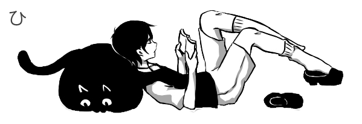

 

 

  

#

<h2 align="center">Sobre mim | About me</h2>

<table>
  <tr>
    <td width="50%" valign="top">
      <h3 align="center">PT-BR</h3>
      

        Sou estudante de <strong>Análise e Desenvolvimento de Sistemas</strong> pela UNIFACS, construindo minha trajetória na área de tecnologia por meio de estudos, projetos práticos e desenvolvimento constante.
      

      

        Tenho conhecimentos em <strong>lógica de programação, Java, SQL, Programação Orientada a Objetos, modelagem de software, estruturas de dados, HTML5, CSS3, JavaScript, TypeScript, React, Tailwind CSS, Supabase e Shopify/Liquid</strong>.
      

      

        Tenho interesse em desenvolvimento de sistemas, criação de interfaces, landing pages, portfólios interativos e soluções web funcionais, responsivas e com identidade visual. Cada projeto aqui representa uma etapa do meu crescimento como desenvolvedora.
      

    </td>
    <td width="50%" valign="top">
      <h3 align="center">EN</h3>
      

        I am a <strong>Systems Analysis and Development</strong> student at UNIFACS, building my path in technology through continuous learning, practical projects and hands-on experience.
      

      

        I have knowledge in <strong>programming logic, Java, SQL, Object-Oriented Programming, software modeling, data structures, HTML5, CSS3, JavaScript, TypeScript, React, Tailwind CSS, Supabase and Shopify/Liquid</strong>.
      

      

        I am interested in system development, interface design, landing pages, interactive portfolios and functional, responsive web solutions with strong visual identity. Each project here represents a step in my growth as a developer.
      

    </td>
  </tr>
</table>

#

 

<table>
  <tr>
    <td align="center">
      <code>Waiting for something to happen?</code>
    </td>
  </tr>
</table>

---

<h2 align="center">Conhecimentos técnicos | Technical skills</h2>

  

  

<table>
  <tr>
    <td align="center" width="25%">
      <strong>Área | Area</strong>
    </td>
    <td align="center" width="37%">
      <strong>PT-BR</strong>
    </td>
    <td align="center" width="38%">
      <strong>EN</strong>
    </td>
  </tr>

  <tr>
    <td align="center">
      <strong>Base técnica</strong> 
      Technical foundation
    </td>
    <td align="center">
      Lógica de programação 
      Java 
      Programação Orientada a Objetos 
      Estruturas de dados 
      SQL 
      Modelagem de software
    </td>
    <td align="center">
      Programming logic 
      Java 
      Object-Oriented Programming 
      Data structures 
      SQL 
      Software modeling
    </td>
  </tr>

  <tr>
    <td align="center">
      <strong>Front-end</strong> 
      Web development
    </td>
    <td align="center">
      HTML5 
      CSS3 
      JavaScript 
      TypeScript 
      React 
      Tailwind CSS
    </td>
    <td align="center">
      HTML5 
      CSS3 
      JavaScript 
      TypeScript 
      React 
      Tailwind CSS
    </td>
  </tr>

  <tr>
    <td align="center">
      <strong>Interfaces</strong> 
      UI / UX
    </td>
    <td align="center">
      Design responsivo 
      Mobile-first 
      UI/UX para interfaces web 
      Landing pages 
      Portfólios interativos 
      Interfaces de e-commerce
    </td>
    <td align="center">
      Responsive design 
      Mobile-first 
      UI/UX for web interfaces 
      Landing pages 
      Interactive portfolios 
      E-commerce interfaces
    </td>
  </tr>

  <tr>
    <td align="center">
      <strong>Interações</strong> 
      Features
    </td>
    <td align="center">
      Manipulação do DOM 
      LocalStorage 
      Animações CSS 
      Transições 
      Hover effects 
      Microinterações
    </td>
    <td align="center">
      DOM manipulation 
      LocalStorage 
      CSS animations 
      Transitions 
      Hover effects 
      Microinteractions
    </td>
  </tr>

  <tr>
    <td align="center">
      <strong>Funcionalidades</strong> 
      Project features
    </td>
    <td align="center">
      Carrinho funcional 
      Filtros de produtos 
      Favoritos 
      Quiz interativo 
      Login fictício 
      Pedido via WhatsApp
    </td>
    <td align="center">
      Functional cart 
      Product filters 
      Favorites 
      Interactive quiz 
      Fictional login 
      WhatsApp ordering
    </td>
  </tr>

  <tr>
    <td align="center">
      <strong>Ferramentas</strong> 
      Tools
    </td>
    <td align="center">
      Git e GitHub 
      GitHub Pages 
      Vercel 
      VS Code 
      Supabase 
      Office / Google Workspace
    </td>
    <td align="center">
      Git and GitHub 
      GitHub Pages 
      Vercel 
      VS Code 
      Supabase 
      Office / Google Workspace
    </td>
  </tr>

  <tr>
    <td align="center">
      <strong>Shopify</strong> 
      E-commerce
    </td>
    <td align="center">
      Shopify structure 
      Liquid 
      Shopify Theme Development
    </td>
    <td align="center">
      Shopify structure 
      Liquid 
      Shopify Theme Development
    </td>
  </tr>
</table>

---

<table>
  <tr>
    <td align="center">
      <code>A quiet mind, a blank screen, and something waiting to exist.</code>
    </td>
  </tr>
</table>

---

<h2 align="center">Projetos em destaque | Featured projects</h2>

<table>
  <tr>
    <td width="33%" align="center" valign="top">
      <h3>Something To Do</h3>
      

        <strong>PT-BR:</strong> Lista de tarefas com prioridades, filtros, contadores e salvamento local.
      

      

        <strong>EN:</strong> To-do list with priorities, filters, counters and local storage.
      

      

        <code>HTML</code> <code>CSS</code> <code>JavaScript</code> <code>LocalStorage</code>
      

      
        
      
    </td>

<td width="33%" align="center" valign="top">
  <h3>Portfolio</h3>
  

    <strong>PT-BR:</strong> Portfólio pessoal com estética monocromática, alternância entre WHITE SPACE e BLACK SPACE e interações visuais.
  

  

    <strong>EN:</strong> Personal portfolio with a monochrome aesthetic, WHITE SPACE / BLACK SPACE switch and visual interactions.
  

  

    <code>HTML</code> <code>CSS</code> <code>JavaScript</code> <code>UI</code>
  

  
    
  
</td>

<td width="33%" align="center" valign="top">
  <h3>Noir Café</h3>
  

    <strong>PT-BR:</strong> Cardápio digital interativo com filtros, carrinho, quiz, login fictício e pedido via WhatsApp.
  

  

    <strong>EN:</strong> Interactive digital menu with filters, cart, quiz, fictional login and WhatsApp ordering.
  

  

    <code>HTML</code> <code>CSS</code> <code>JavaScript</code> <code>LocalStorage</code>
  

  
    
  
</td>

  </tr>
</table>

---

<table>
  <tr>
    <td align="center">
      <code>The screen is not empty anymore.</code> 
      <code>Three fragments were saved.</code> 
      <code>The project continues.</code>
    </td>
  </tr>
</table>

---

<h2 align="center">Contato | Contact</h2>

<strong>PT-BR:</strong> Entre em contato comigo pelos links abaixo. 
<strong>EN:</strong> Feel free to contact me through the links below.

---

  

  

  

